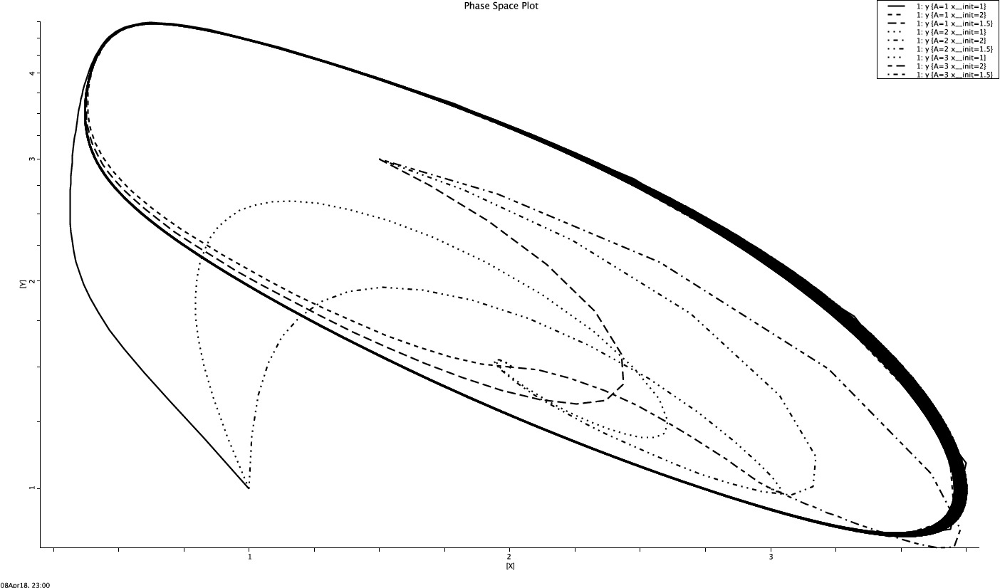

# Brusselator

The Brusselator is a theoretical model for a type of autocatalytic reaction. The Brusselator model was proposed by Ilya Prigogine and his collaborators at the Université Libre de Bruxelles. It is a portmanteau of Brussels and oscillator.

It is characterized by the reactions:

A -> X  
2X + Y -> 3X  
B + X -> Y + D  
X -> E.  

I have modelled it computationally using JSIM. It is a very basic compuational software that is powerful too. One plot is attached and with little manipulations a varied kind of results could be achieved too. 

### Graphs:

**  **

